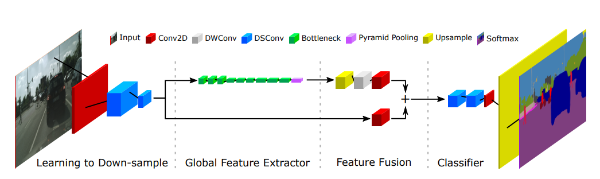

# Fast-SCNN
## 基于如下论文复现该网络  
[fast-scnn paper](https://arxiv.org/pdf/1902.04502.pdf)
## 网络架构

## 网络结构详情
|Input|Block|t|c|n|s|
|:-:|---|---|---|---|---|
|1024 × 2048 × 3|Conv2D|-|32|1|2|
|512 × 1024 × 32|DSConv|-|48|1|2|
|256 × 512 × 48|DSConv|-|64|1|2|
|128 × 256 × 64|bottleneck|6|64|3|2|
|64 × 128 × 64|bottleneck|6|96|3|2|
|32 × 64 × 96|bottleneck|6|128|3|1|
|32 × 64 × 128|PPM|-|128|-|-|
|32 × 64 × 128|FFM|-|128|-|-|
|128 × 256 × 128|DSConv|-|128|2|1|
|128 × 256 × 128|Conv2D|-|nums of classes|1|1|
  
Table 1  
  
|Input|Operator|Output|
|:-:|---|---|
|h × w × c|Conv2D 1/1, f|h × w × tc|
|h × w × tc|DWConv 3/s, f|h/s x w/s x tc|
|h/s x w/s x tc|Conv2D 1/1, −|h/s x w/s x c'|
  
Table 2
## 使用方法
### 数据准备
准备原图文件夹 img，准备label图文件夹 label，然后准备好train.txt 和 val.txt，放在同一级目录下，结构如下：  
dataset  
|train.txt  
|val.txt  
└--img  
| |  image1.jpg  
| |  image2.jpg  
└--label  
 |  image1.png  
 |  image2.png  

 train.txt/val.txt 格式如下：  
 image1.jpg image1.png  
 image2.jpg image2.png  
 ......
 

### 训练脚本准备