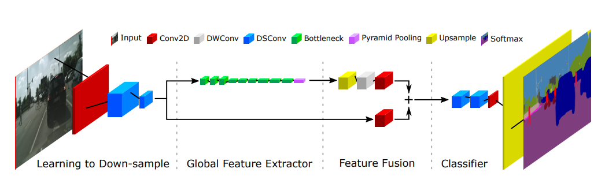

# Fast-SCNN
## 基于如下论文复现该网络 / Implementation based on the following paper
[fast-scnn paper](https://arxiv.org/pdf/1902.04502.pdf)
## 网络架构 / Network Architecture

## 网络结构详情 / Network Structure Details
|Input|Block|t|c|n|s|
|:-:|---|---|---|---|---|
|1024 × 2048 × 3|Conv2D|-|32|1|2|
|512 × 1024 × 32|DSConv|-|48|1|2|
|256 × 512 × 48|DSConv|-|64|1|2|
|128 × 256 × 64|bottleneck|6|64|3|2|
|64 × 128 × 64|bottleneck|6|96|3|2|
|32 × 64 × 96|bottleneck|6|128|3|1|
|32 × 64 × 128|PPM|-|128|-|-|
|32 × 64 × 128|FFM|-|128|-|-|
|128 × 256 × 128|DSConv|-|128|2|1|
|128 × 256 × 128|Conv2D|-|nums of classes|1|1|
  
Table 1  
  
|Input|Operator|Output|
|:-:|---|---|
|h × w × c|Conv2D 1/1, f|h × w × tc|
|h × w × tc|DWConv 3/s, f|h/s x w/s x tc|
|h/s x w/s x tc|Conv2D 1/1, −|h/s x w/s x c'|
  
Table 2

## 使用方法 / Usage

### 安装依赖 / Install Dependencies

```bash
pip install torch torchvision
pip install numpy opencv-python tensorboardX tqdm
```

### 预训练权重 / Pre-trained Weights
基于540x540分辨率，在voc2012数据集上训练了一个权重，各位可以用这个来初始化，节约一些训练时间  
A weight trained on the VOC2012 dataset at 540x540 resolution is available. You can use it for initialization to save training time.  
[https://pan.baidu.com/s/17_pGbpkI4tx8eOMZFS73fA](https://pan.baidu.com/s/17_pGbpkI4tx8eOMZFS73fA)
password:v98k

### 数据准备 / Data Preparation
准备原图文件夹 img，准备label图文件夹 label，然后准备好train.txt 和 val.txt，放在同一级目录下，结构如下：  
Prepare an `img` folder for images and a `label` folder for labels, then prepare `train.txt` and `val.txt` in the same directory. The structure is as follows:

```
dataset/
├── train.txt
├── val.txt
├── img/
│   ├── image1.jpg
│   └── image2.jpg
└── label/
    ├── image1.png
    └── image2.png
```

train.txt/val.txt 格式如下 / format:
```
image1.jpg image1.png
image2.jpg image2.png
......
```

### 训练 / Training

基本训练命令（默认使用VOC2012数据集，21个类别，320×320输入）：  
Basic training command (defaults to VOC2012 dataset, 21 classes, 320×320 input):

```bash
python train.py --data-root voc2012
```

自定义训练参数 / Custom training parameters:

```bash
python train.py \
    --data-root /path/to/dataset \
    --num-classes 21 \
    --epochs 2000 \
    --batch-size 160 \
    --base-lr 0.01 \
    --input-h 320 \
    --input-w 320 \
    --save-dir save \
    --save-freq 20 \
    --log-dir runs
```

所有可用参数 / All available arguments:

| 参数 / Argument | 默认值 / Default | 说明 / Description |
|---|---|---|
| `--data-root` | `voc2012` | 数据集根目录 / Dataset root directory |
| `--train-list` | `<data-root>/train.txt` | 训练列表文件 / Training list file |
| `--val-list` | `<data-root>/val.txt` | 验证列表文件 / Validation list file |
| `--num-classes` | `21` | 分割类别数 / Number of segmentation classes |
| `--epochs` | `2000` | 训练总轮数 / Total training epochs |
| `--base-lr` | `0.01` | 初始学习率 / Initial learning rate |
| `--batch-size` | `160` | 训练批大小 / Training batch size |
| `--val-batch-size` | `4` | 验证批大小 / Validation batch size |
| `--input-h` | `320` | 输入图像高度 / Input image height |
| `--input-w` | `320` | 输入图像宽度 / Input image width |
| `--num-workers` | `32` | 数据加载线程数 / Data loading workers |
| `--save-dir` | `save` | 模型保存目录 / Checkpoint save directory |
| `--save-freq` | `20` | 每N轮保存一次 / Save checkpoint every N epochs |
| `--resume` | - | 恢复训练的检查点路径 / Checkpoint path to resume from |
| `--log-dir` | `runs` | TensorBoard日志目录 / TensorBoard log directory |
| `--multigpu` | `false` | 使用DataParallel多GPU训练 / Use DataParallel multi-GPU |
| `--dist` | `false` | 使用DistributedDataParallel / Use DistributedDataParallel |
| `--momentum` | `0.9` | SGD动量 / SGD momentum |
| `--weight-decay` | `0.0001` | SGD权重衰减 / SGD weight decay |
| `--aux-weight` | `0.4` | 辅助损失权重 / Auxiliary loss weight |

### 恢复训练 / Resume Training

从检查点恢复训练，会自动加载模型权重、优化器状态和训练轮数：  
Resume training from a checkpoint. Model weights, optimizer state, and epoch number are automatically restored:

```bash
python train.py --resume save/train_100.pth --data-root voc2012
```

### TensorBoard 可视化 / TensorBoard Visualization

训练过程中会自动记录以下指标到TensorBoard：  
The following metrics are automatically logged to TensorBoard during training:
- `train/loss`, `val/loss` — 训练/验证损失 / Training/validation loss
- `train/mIoU`, `val/mIoU` — 平均交并比 / Mean Intersection over Union
- `train/mAcc`, `val/mAcc` — 平均准确率 / Mean accuracy
- `train/lr` — 学习率 / Learning rate

查看TensorBoard / View TensorBoard:

```bash
tensorboard --logdir=runs
```

### 多GPU训练 / Multi-GPU Training

**DataParallel（单机多卡）/ DataParallel (single node, multi-GPU):**

```bash
python train.py --multigpu --data-root voc2012
```

**DistributedDataParallel（推荐，性能更优）/ DistributedDataParallel (recommended, better performance):**

```bash
torchrun --nproc_per_node=4 train.py --dist --data-root voc2012
```

### 推理 / Inference

对视频进行分割推理 / Run segmentation inference on video:

```bash
python test.py
```

注意：推理脚本需要训练好的权重文件 `save/train_1999.pth` 和测试视频 `test.mp4`。  
Note: The inference script requires a trained weight file at `save/train_1999.pth` and a test video `test.mp4`.

## TODO
- [x] Training & Validate functions
- [x] Tensorboard 记录 / TensorBoard logging
- [x] resume training 脚本 / Resume training script
- [x] VOC2012数据集训练脚本 / VOC2012 dataset training script
- [x] 多GPU训练 / Multi-GPU training
## Support Me
If you want to speedup my progress, please support me.  
<a href="https://www.buymeacoffee.com/winafoxq"></a>

## Star History

[](https://www.star-history.com/#zacario-li/Fast-SCNN_pytorch&Date)
